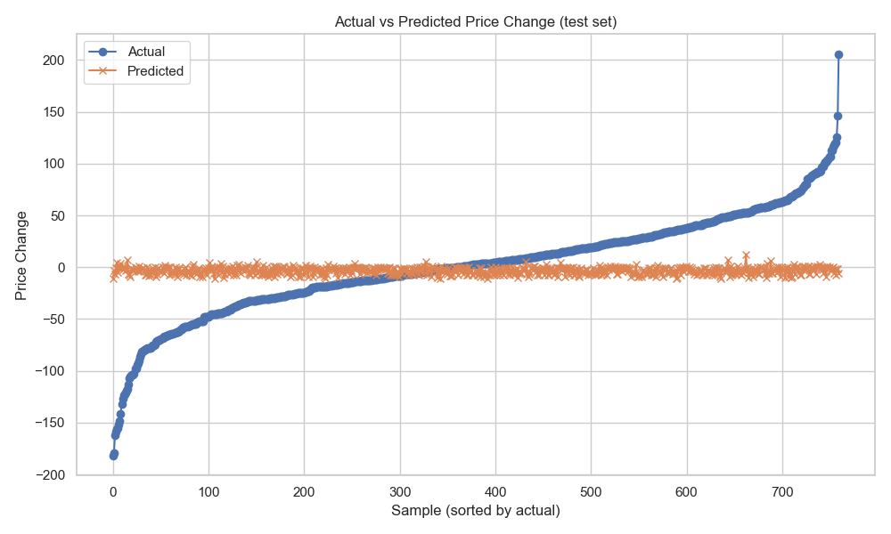
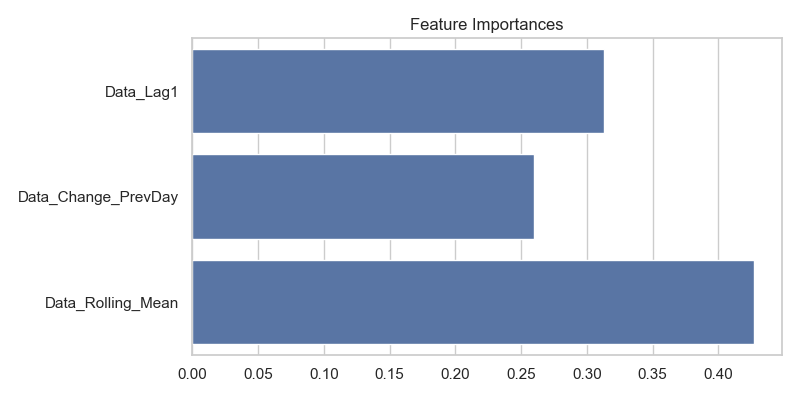
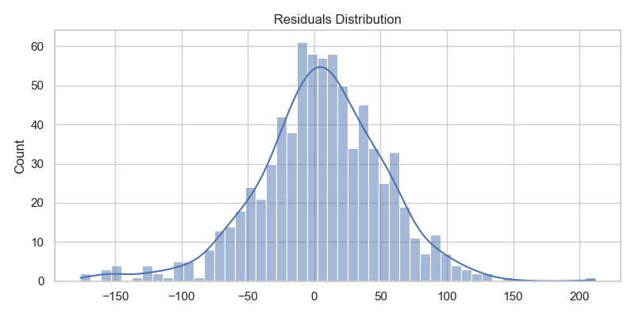
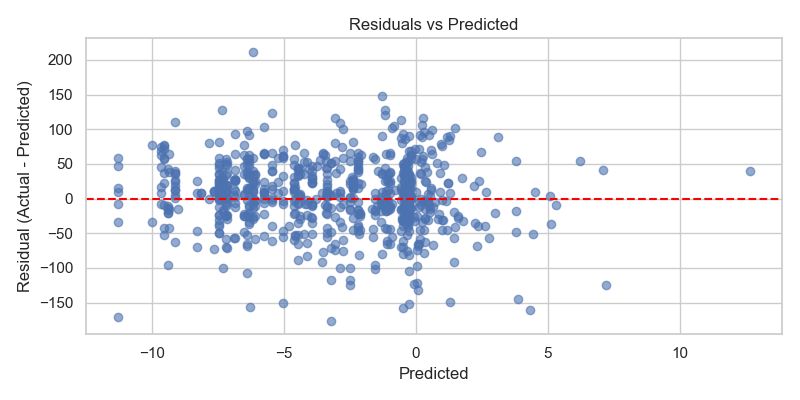

# Stock Price Prediction

This project demonstrates a machine learning approach to predict stock price movements based on an external data source.

## 1. Approach and Assumptions

The primary assumption is that the stock price movement is influenced by the change in an external data source, referred to as 'Data'. While other factors can influence stock prices, they are not considered in this model.

The approach involves the following steps:
- Preprocessing the data to create meaningful features.
- Training a machine learning model to predict the change in stock price.
- Exposing the model through a REST API.
- Containerizing the application for easy deployment.

## 2. Data Preprocessing

The data preprocessing is handled by the `src/preprocessing.py` script. The key steps are:

- **Loading Data**: Two datasets, `Data.csv` and `StockPrice.csv`, are loaded.
- **Feature Engineering**:
    - **Lag Features**: Lagged values of the 'Data' column are created to represent past values.
    - **Change Features**: The change in 'Data' from the previous day is calculated.
    - **Rolling Mean**: A rolling mean of the 'Data' is calculated to capture trends.
- **Target Variable**: The target variable is the change in stock price from the previous day.
- **Merging**: The two datasets are merged based on the 'Date' column.
- **Handling Missing Values**: Rows with missing values are dropped.

## 3. Model Selection and Evaluation

A **Random Forest Regressor** is chosen for this task due to its ability to capture non-linear relationships in the data. The model is trained in `src/train.py`.

- **Features**: The model is trained on the following features:
    - `Data_Lag1`: The 'Data' value from the previous day.
    - `Data_Change_PrevDay`: The change in 'Data' from the day before.
    - `Data_Rolling_Mean`: The rolling mean of the 'Data'.
- **Target**: The model predicts the `Price_Change`.
- **Evaluation**: The model's performance is evaluated using R-squared and Root Mean Squared Error (RMSE). The notebook `notebooks/Stock_analysis.ipynb` contains a detailed analysis and evaluation of the model.

## 4. Key Insights and Conclusions

- A simple linear regression model fails to predict the stock price accurately due to the non-linear nature of the data and the time-series trend.
- By predicting the *change* in price instead of the absolute price, the model can better capture the market dynamics.
- The Random Forest model, combined with feature engineering, provides a significant improvement in prediction accuracy.

## 5. API and Docker

The trained model is served through a FastAPI application (`app/main.py`).

- **Endpoint**: The API has a `/predict` endpoint that accepts a POST request with the required features and returns the predicted price change.
- **Docker**: The project includes a `Dockerfile` to containerize the application. The Docker image builds the application, trains the model, and runs the FastAPI server. This allows for easy and reproducible deployment.

## Run locally (quick)

1. Create and activate virtual environment (Windows PowerShell):

```powershell
python -m venv venv
.\venv\Scripts\Activate.ps1
```

2. Install dependencies (the repo's `requirements.txt` includes `scikit-learn` and `joblib`):

```powershell
python -m pip install --upgrade pip
pip install -r requirements.txt
```

3. Train the model (this script now performs a train/test split, scales features, prints MSE and R2, saves metrics and a prediction plot):

```powershell
python -m src.train
```

Artifacts created under `models/`:
- `FF_Model.pkl` — trained RandomForest model
- `scaler.pkl` — feature scaler (used for consistent preprocessing)
- `metrics.json` — contains `mse`, `r2`, `n_samples`, and feature list
- `prediction_plot.png` — Actual vs Predicted plot for the test set

4. Run the API:

```powershell
uvicorn app.main:app --reload --host 0.0.0.0 --port 8000
```

5. Example request (PowerShell):

```powershell
Invoke-RestMethod -Uri "http://127.0.0.1:8000/predict" -Method POST -ContentType "application/json" -Body '{"data_lag1":2.35,"data_change_prev_day":-0.015,"data_rolling_mean":2.38}'
```

If you'd like, I can add a `/metrics` endpoint to return `metrics.json` or update the API to load and use the saved `scaler.pkl` before predicting (recommended for production). 

## Artifacts and Diagnostics

After training (`python -m src.train`) the following artifacts are written to the `models/` directory:

- `FF_Model.pkl` — trained RandomForest model used by the API
- `scaler.pkl` — `StandardScaler` fitted on the training features (applied at inference)
- `metrics.json` — evaluation metrics and metadata (contains `mse`, `r2`, `n_samples`, feature list, `target_transform` flag)
- `prediction_plot.png` — Actual vs Predicted plot for the test set
- `feature_importance.png` — barplot of feature importances from the model
- `residuals_scatter.png` — residuals vs predicted scatter plot
- `residuals_hist.png` — histogram of residuals (with KDE)
- `test_predictions.csv` — raw test rows with `actual`, `predicted`, and `residual` columns

You can view these files directly (open `models/prediction_plot.png` etc.) or from the notebook `notebooks/Stock_analysis.ipynb`.

### Example Images

Prediction vs Actual (test set):



Feature importances:



Residuals distribution:



Residuals vs Predicted:



## Why predictions changed between runs

- The project stores the model file name as `FF_Model.pkl` (see `src/config.py`). If you had an earlier model named differently (e.g. `rf_model.pkl`) the API would have used that older file.
- The training code was updated to:
  - use a 5-day rolling mean (feature change),
  - perform a chronological 80/20 train/test split,
  - apply feature scaling with `StandardScaler` and save `scaler.pkl`, and
  - optionally apply a signed-log target transform before training (controlled by `TARGET_TRANSFORM` in `src/train.py`).

These changes (especially scaling and the target transform) will change the numeric predictions. To reproduce a previous result you can either:

- restore an older model file (if you kept it under `models/` as `rf_model.pkl`), or
- retrain with `TARGET_TRANSFORM=False` and/or tweak hyperparameters in `src/train.py`.


## Next steps and suggestions

- Use a time-series cross-validation (forward chaining) for more robust evaluation.
- Add additional engineered features (more lags, percent change, rolling volatility) to help the model capture extremes.
- Try alternative models (GradientBoosting, LightGBM) or quantile regression to predict tails.
- Add a `/metrics` API endpoint to surface `metrics.json` and optionally serve the diagnostic images.

If you want, I can add any of the above changes and/or a small `tools/compare_models.py` script to make comparisons reproducible.
